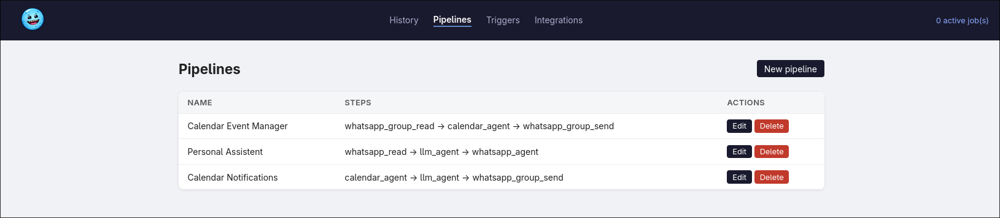
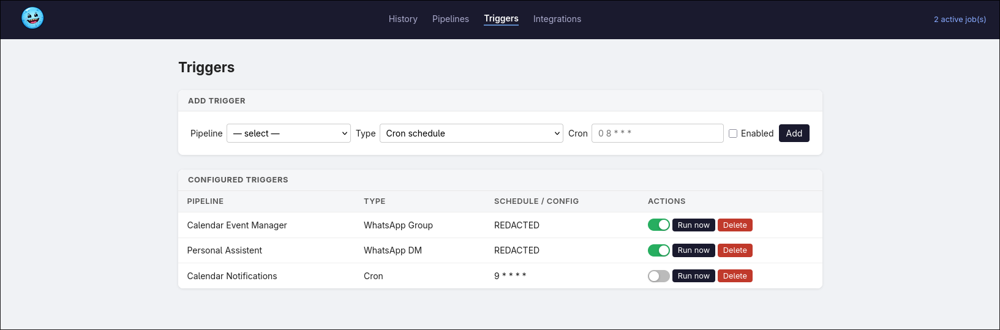

 A personal AI assistant that automates life tasks using LLMs.  

Powered by [agntrick](https://github.com/jeancsil/agntrick).

## Overview

mee6 runs scheduled AI agents that connect to external services on your behalf.
It exposes a web UI to configure pipelines and triggers, and supports both Anthropic (Claude)
and Ollama (local LLMs) as backends.

**Runtime:** Python 3.12, managed with `uv`, deployed via Docker.
**LLM backends:** Anthropic Claude (cloud) or Ollama (self-hosted).
**Agent framework:** [agntrick](https://github.com/jeancsil/agntrick) + agntrick-whatsapp.

> **Warning:** This project is not production-ready. It is a personal tool shared as-is.
> Before running it, read the code and understand what it does — it connects to external
> services (WhatsApp, Google Calendar, LLM APIs), executes scheduled automations, and
> stores data in a local database. You are responsible for any consequences of its use.

## Screenshots




## Quick start

```bash
# 1. Copy and fill in your credentials
cp .env.example .env

# 2. Install dependencies
uv sync

# 3. Start PostgreSQL
docker run -d -p 5432:5432 -e POSTGRES_USER=mee6 -e POSTGRES_PASSWORD=mee6 -e POSTGRES_DB=mee6 postgres:16

# 4. Run locally (dev mode)
uvicorn mee6.web.app:app --reload --port 8080
```

Open http://localhost:8080 to access the dashboard.

## Docker

```bash
docker compose up -d
```

Starts PostgreSQL, Ollama (optional, with GPU passthrough if available), and mee6 on port `8080`.
Persistent data (PostgreSQL, WhatsApp session, browser profiles) is stored in `./data/`.

## Configuration

Configuration is loaded from environment variables, `.mee6.conf`, or `~/.config/agntrick/.env`.

| Variable | Description |
|---|---|
| `ANTHROPIC_API_KEY` | Anthropic API key for Claude |
| `OLLAMA_BASE_URL` | URL of your Ollama server (e.g. `http://192.168.1.x:11434`) |
| `OLLAMA_DEFAULT_MODEL` | Default Ollama model (default: `llama3`) |
| `DATABASE_URL` | PostgreSQL connection string |
| `WHATSAPP_STORAGE_PATH` | Path for WhatsApp session data (default: `./data/whatsapp`) |
| `GOOGLE_CALENDAR_ID` | Google Calendar ID to write events to |
| `GOOGLE_CREDENTIALS_FILE` | Path to Google service account credentials JSON |
| `PIPELINE_STEP_TIMEOUT_S` | Per-step execution timeout in seconds (default: `300`) |

To switch the default LLM provider, edit `.agntrick.yaml`:

```yaml
llm:
  provider: ollama          # or: anthropic
  model: llama3             # or: claude-sonnet-4-6
  base_url: http://192.168.1.x:11434   # only needed for ollama
  temperature: 0.2
```

## Pipelines

Pipelines are sequences of steps. Each step runs an agent plugin and passes its output
to the next step. Steps can reference previous output using placeholders like
`{input}`, `{previous_output}`, and `{date}`.

### Available plugins

| Plugin | Description |
|---|---|
| `llm_agent` | Call Claude or Ollama with a prompt |
| `browser_agent` | Automate web tasks using browser-use |
| `whatsapp_read` | Read recent DMs from a contact |
| `whatsapp_send` | Send a DM to a contact |
| `whatsapp_group_read` | Read recent messages from a WhatsApp group |
| `whatsapp_group_send` | Send a message to a WhatsApp group |
| `calendar_agent` | Create/update/delete Google Calendar events via Claude tool use |

## Triggers

Pipelines can be triggered in three ways:

- **CRON** — standard cron expression (e.g. `0 8 * * *` = daily at 8am)
- **WhatsApp DM** — fires when a message arrives from a specific phone number
- **WhatsApp Group** — fires when a message arrives in a specific group

Triggers can be enabled/disabled or run immediately from the web UI.

## Integrations

### WhatsApp

Connect via the **Integrations** page by scanning a QR code. The session is persisted
locally and reconnects automatically on restart.

Messages are silently discarded unless there is an enabled trigger configured for that
sender or group — no processing happens for unknown sources.

### Google Calendar

Add a service account credentials JSON file (via `GOOGLE_CREDENTIALS_FILE` or the
Integrations page), then share the target calendar with the service account email.
Use the `calendar_agent` plugin step to create, update, or delete events.

### Ollama

Point `OLLAMA_BASE_URL` at an existing Ollama server. The `docker-compose.yml` includes
an optional Ollama service with GPU passthrough and auto-pulls `phi4:14b` on startup.

## Project structure

```
mee6/
├── mee6/
│   ├── config.py               # pydantic-settings, loads .env / .mee6.conf
│   ├── web/                    # FastAPI app + Jinja2 UI
│   ├── scheduler/              # APScheduler engine + trigger dispatch
│   ├── agents/                 # LLM, browser, and calendar agent wrappers
│   ├── pipelines/              # Pipeline executor, plugin registry, plugins/
│   ├── integrations/           # WhatsApp session, Google Calendar API
│   └── db/                     # SQLAlchemy models, migrations, repository
├── db/
│   ├── schema.sql              # Reference schema
│   └── migrations/             # SQL migration files (applied at startup)
└── tests/
```

## Development

```bash
# Run tests
uv run --extra dev pytest

# Lint / format
uv run --extra dev ruff check .
uv run --extra dev ruff format .
```
